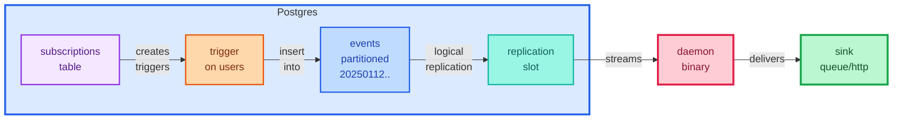

# Postgres Stream

Reliably stream Postgres table changes to external systems (queues, webhooks, etc.) with automatic failover and zero event loss.

## How Does It Work?

1. **User manages subscriptions** directly in the database (`pgstream.subscriptions` table)
2. **Subscription changes automatically create database triggers** on the target tables
3. **Application events fire the managed triggers**, which insert into a partitioned `events` table
4. **The daemon streams events** via Postgres logical replication and delivers them to your sink



<details>
<summary>Example of generated trigger function (simplified for readability)</summary>

```sql
-- Auto-generated when you insert into subscriptions table
create or replace function pgstream._publish_after_insert_on_users()
returns trigger as $$
declare
  v_jsonb_output jsonb := '[]'::jsonb;
  v_base_payload jsonb := jsonb_build_object(
    'tg_op', tg_op,
    'tg_table_name', tg_table_name,
    'tg_table_schema', tg_table_schema,
    'timestamp', (extract(epoch from now()) * 1000)::bigint
  );
begin
  -- Check subscription "user-signup" condition
  if new.email_verified = true then
    v_jsonb_output := v_jsonb_output || (jsonb_build_object(
      'tg_name', 'user-signup',
      'new', jsonb_build_object('id', new.id, 'email', new.email),
      'old', null
    ) || v_base_payload || '{}'::jsonb); -- payload_extensions would go here
  end if;

  -- Write to events table if any subscriptions matched
  if jsonb_array_length(v_jsonb_output) > 0 then
    insert into pgstream.events (payload, stream_id)
    select elem, 1
    from jsonb_array_elements(v_jsonb_output) as t(elem);
  end if;

  return new;
end;
$$ language plpgsql
set search_path = ''
security definer;

-- Trigger that calls the function
create constraint trigger pgstream_insert
after insert on public.users
deferrable initially deferred
for each row
when ((new.email_verified = true))
execute procedure pgstream._publish_after_insert_on_users();
```

> **Note:** The actual generated code handles multiple subscriptions per table, merges `when` clauses with OR logic, and includes all `payload_extensions`. This example shows the structure for a single subscription.

</details>

## Benefits

- **Single binary** - No complex infrastructure or high-availability destinations required
- **Postgres-native durability** - Events are stored in the database, WAL can be released immediately
- **Automatic failover** - Daemon queries the `events` table to replay missed events after recovery
- **No data loss** - As long as downtime is less than partition retention (7 days by default)

## Drawbacks

- **Small overhead** - Additional INSERT into `events` table on every subscribed operation
- **Partition management** - Need to monitor partition growth if event volume is very high
- **Not for dynamic subscriptions** - Each subscription change recreates database triggers (expensive operation)

## Using It

### 1. Requirements

- Postgres 15+ with `wal_level=logical`
- User with `replication` privilege

### 2. Configuration

Create `config.yaml`:

```yaml
stream:
  id: 1  # Unique stream ID
  pg_connection:
    host: localhost
    port: 5432
    name: mydb
    username: postgres
    password: postgres
    tls:
      enabled: false
  batch:
    max_size: 1000      # Events per batch
    max_fill_secs: 5    # Max time to fill batch

sink:
  type: memory  # Built-in test sink
```

### 3. Run the Daemon

```bash
# Start the daemon
postgres-stream

# Or with Docker
docker run -v $(pwd)/config.yaml:/config.yaml postgres-stream
```

### 4. Create Subscriptions

Subscriptions define which events to capture. Simply insert into the `subscriptions` table:

```sql
-- Subscribe to verified user signups
insert into pgstream.subscriptions (
  key,
  stream_id,
  operation,
  schema_name,
  table_name,
  when_clause,
  column_names,
  payload_extensions
) values (
  'user-signup',                          -- Unique identifier
  1,                                      -- Stream ID from config
  'INSERT',                               -- Operation: INSERT, UPDATE, or DELETE
  'public',                               -- Schema name
  'users',                                -- Table name
  'new.email_verified = true',            -- Optional filter (SQL expression)
  array['id', 'email', 'created_at'],     -- Columns to include in payload
  '[]'::jsonb                             -- Payload extensions (see below)
);
```

This automatically creates the trigger on `public.users`. Now when you insert a verified user, the event is captured.

**To reduce no-op trigger recreation** (important for production), use merge to only update when values actually change:

<details>
<summary>Click to show merge-based helper function</summary>

```sql
-- Helper function that only recreates triggers when subscription actually changes
create or replace function set_subscriptions(
  p_stream_id bigint,
  p_subscriptions pgstream.subscriptions[]
)
returns void
language plpgsql
security definer
set search_path to ''
as $$
begin
  create temporary table temp_subscriptions as
  select * from unnest(p_subscriptions);

  -- Only update if values actually changed (avoids trigger recreation)
  merge into pgstream.subscriptions as target
  using temp_subscriptions as source
  on (target.key = source.key and target.stream_id = p_stream_id)
  when matched and (
    target.operation is distinct from source.operation or
    target.schema_name is distinct from source.schema_name or
    target.table_name is distinct from source.table_name or
    target.when_clause is distinct from source.when_clause or
    target.column_names is distinct from source.column_names or
    target.metadata is distinct from source.metadata or
    target.payload_extensions is distinct from source.payload_extensions
  ) then update set
    operation = source.operation,
    schema_name = source.schema_name,
    table_name = source.table_name,
    when_clause = source.when_clause,
    column_names = source.column_names,
    metadata = source.metadata,
    payload_extensions = source.payload_extensions
  when not matched then insert (
    key, stream_id, operation, schema_name, table_name,
    when_clause, column_names, metadata, payload_extensions
  ) values (
    source.key, p_stream_id, source.operation, source.schema_name,
    source.table_name, source.when_clause, source.column_names,
    source.metadata, source.payload_extensions
  );

  -- Remove subscriptions not in input
  delete from pgstream.subscriptions
  where stream_id = p_stream_id
    and not exists (
      select 1 from temp_subscriptions
      where pgstream.subscriptions.key = temp_subscriptions.key
    );

  drop table temp_subscriptions;
end;
$$;
```

</details>

### 5. Testing Your Subscription

Now when a user signs up with verified email:

```sql
insert into users (email, email_verified) values ('user@example.com', true);
```

The sink receives:

```json
{
  "tg_name": "user-signup",
  "tg_op": "INSERT",
  "tg_table_name": "users",
  "tg_table_schema": "public",
  "timestamp": 1703001234567,
  "new": {
    "id": 123,
    "email": "user@example.com",
    "created_at": "2024-12-12T10:30:00Z"
  },
  "old": null
}
```

### 6. Add Metadata with Payload Extensions

Add dynamic routing information or static metadata using `payload_extensions`:

```sql
insert into pgstream.subscriptions (
  key, stream_id, operation, schema_name, table_name,
  when_clause, column_names, payload_extensions
) values (
  'order-notification',
  1,
  'INSERT',
  'public',
  'orders',
  null,
  array['id', 'user_id', 'total'],
  '[
    {"json_path": "group_id", "expression": "new.user_id::text"},
    {"json_path": "queue_name", "expression": "''orders-high-priority''"}
  ]'::jsonb
);
```

Result:

```json
{
  "tg_name": "order-notification",
  "new": {"id": 456, "user_id": 123, "total": 99.99},
  "group_id": "123",
  "queue_name": "orders-high-priority"
}
```

Common use cases:
- **Routing**: Add `group_id` for partitioning in Kafka/queues
- **Static metadata**: Add `queue_name`, `priority`, `tenant_id`
- **Dynamic values**: Add computed fields like `new.created_at::date`
- **Context info**: Add `auth.user_id()`, `current_setting('app.tenant_id')`

## How Failover Works

**Scenario:** Your message queue goes down for 2 hours.

```
10:00 - Queue fails, event #1000 can't be delivered
10:00 - Daemon saves checkpoint: event #1000 ID in database
10:00 - Daemon continues consuming replication stream (new events still written to events table)
12:00 - Queue recovers
12:00 - Daemon tries checkpoint event again → succeeds
12:00 - Daemon uses COPY to stream all events from table between checkpoint and current batch
12:00 - Replays all missed events in order
12:01 - Returns to normal streaming mode
```

**Guarantees:**
- No events lost (if downtime < 7 days partition retention)
- Events delivered at least once (may retry on failure)
- Order preserved within daily partitions
- No WAL retention required (events are in table, not WAL)

## Automated Partition Management

The daemon automatically manages daily partitions in the background:

**Retention policy:**
- **Creates partitions** 3 days in advance (today, tomorrow, day after)
- **Drops partitions** older than 7 days
- **Runs on startup** and then daily

## Implementing Custom Sinks

Create custom sinks to deliver events to any destination (HTTP, Kafka, RabbitMQ, etc.).

> **Important:** Sink dependencies and implementations should be behind feature flags to avoid bloating the binary. Users should only compile the sinks they actually use.

### 1. Add Dependencies with Feature Flags

Update `Cargo.toml`:
```toml
[dependencies]
# Existing dependencies...

# Optional sink dependencies
reqwest = { version = "0.11", features = ["json"], optional = true }
rdkafka = { version = "0.36", optional = true }

[features]
# Sink feature flags
sink-http = ["dep:reqwest"]
sink-kafka = ["dep:rdkafka"]
```

### 2. Create the Sink Implementation

Create a new file `src/sink/http.rs`:

```rust
use etl::error::EtlResult;
use reqwest::Client;
use serde::Deserialize;
use tracing::info;

use crate::sink::Sink;
use crate::types::TriggeredEvent;

#[derive(Clone, Debug, Deserialize)]
pub struct HttpSinkConfig {
    pub url: String,
    #[serde(default)]
    pub headers: std::collections::HashMap<String, String>,
}

#[derive(Clone)]
pub struct HttpSink {
    config: HttpSinkConfig,
    client: Client,
}

impl HttpSink {
    pub fn new(config: HttpSinkConfig) -> Self {
        let client = Client::new();
        Self { config, client }
    }
}

impl Sink for HttpSink {
    fn name() -> &'static str {
        "http"
    }

    async fn publish_events(&self, events: Vec<TriggeredEvent>) -> EtlResult<()> {
        for event in events {
            let mut request = self.client
                .post(&self.config.url)
                .json(&event.payload);

            // Add custom headers
            for (key, value) in &self.config.headers {
                request = request.header(key, value);
            }

            let response = request.send().await?;

            if !response.status().is_success() {
                return Err(etl::etl_error!(
                    etl::error::ErrorKind::Network,
                    "HTTP request failed: {}",
                    response.status()
                ));
            }

            info!("published event {} to {}", event.id.id, self.config.url);
        }

        Ok(())
    }
}
```

### 3. Register in `src/sink/mod.rs`

```rust
mod base;
pub mod memory;

#[cfg(feature = "sink-http")]
pub mod http;

pub use base::Sink;
```

### 4. Add to SinkConfig Enum

Update `src/config/sink.rs`:

```rust
use serde::Deserialize;

#[cfg(feature = "sink-http")]
use crate::sink::http::HttpSinkConfig;

#[derive(Clone, Debug, Deserialize)]
#[serde(tag = "type", rename_all = "lowercase")]
pub enum SinkConfig {
    Memory,

    #[cfg(feature = "sink-http")]
    Http(HttpSinkConfig),
}
```

### 5. Wire Up in Core

Update `src/core.rs`:

```rust
#[cfg(feature = "sink-http")]
use crate::sink::http::HttpSink;

// In start_pipeline_with_config():
let sink = match &config.sink {
    SinkConfig::Memory => MemorySink::new(),

    #[cfg(feature = "sink-http")]
    SinkConfig::Http(cfg) => HttpSink::new(cfg.clone()),
};
```

### 6. Build and Use

Build with the HTTP sink feature:
```bash
cargo build --release --features sink-http
```

Use in `config.yaml`:
```yaml
sink:
  type: http
  url: https://webhook.example.com/events
  headers:
    Authorization: Bearer token123
    X-Custom-Header: value
```


