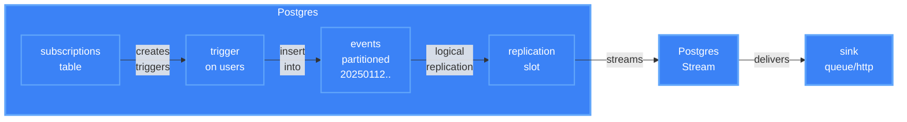

# How It Works

## Overview

Events are inserted into `pgstream.events` and streamed via logical replication to your sink.

**Two ways to create events:**

1. **Subscriptions** (optional) - Define triggers that automatically capture table changes
2. **Manual inserts** - Insert directly into `pgstream.events` from your application

See [Manual Events](manual-events.md) for the direct insert approach.



## Why This Approach?

Postgres Stream uses logical replication, but subscribes only to the `events` table instead of your application tables.

Traditional CDC reads application tables directly:

- WAL retention grows if the sink is slow
- Slot invalidation = data loss
- Recovery depends on WAL availability
- Destination must be highly available (e.g. Kafka cluster) to avoid data loss

But we only care about the events we subscribed to, and do not want to replicate your entire database! By streaming from a single partitioned `events` table, we get:

- WAL released immediately after event written
- Events table provides durability (7-day retention)
- Recovery reads from the table, not WAL
- Slot invalidation triggers automatic recovery
- Destination can be simple (single webhook, Redis instance) - no HA required

## Subscriptions (Optional)

When you insert a subscription, Postgres Stream creates a trigger on the target table:

```sql
-- Auto-generated when you insert into subscriptions table
create or replace function pgstream._publish_after_insert_on_users()
returns trigger as $$
declare
  v_jsonb_output jsonb := '[]'::jsonb;
  v_base_payload jsonb := jsonb_build_object(
    'tg_op', tg_op,
    'tg_table_name', tg_table_name,
    'tg_table_schema', tg_table_schema,
    'timestamp', (extract(epoch from now()) * 1000)::bigint
  );
begin
  -- Check subscription "user-signup" condition
  if new.email_verified = true then
    v_jsonb_output := v_jsonb_output || (jsonb_build_object(
      'tg_name', 'user-signup',
      'new', jsonb_build_object('id', new.id, 'email', new.email),
      'old', null
    ) || v_base_payload);
  end if;

  -- Write to events table if any subscriptions matched
  if jsonb_array_length(v_jsonb_output) > 0 then
    insert into pgstream.events (payload, stream_id)
    select elem, 1
    from jsonb_array_elements(v_jsonb_output) as t(elem);
  end if;

  return new;
end;
$$ language plpgsql;
```

The actual generated code handles multiple subscriptions per table, merges `when` clauses with OR logic, and includes all payload extensions.

## Event Flow

1. **Event written** - Via subscription trigger or direct insert into `pgstream.events`
2. **Logical replication** - Postgres Stream receives the event
3. **Sink delivery** - Event delivered to your configured sink

## Partitioned Events Table

Events are stored in a partitioned table with daily partitions:

- **7-day retention** by default
- **Automatic partition creation** 7 days ahead
- **Automatic partition cleanup** for old data
- Partitioning keeps the table fast and manageable

## Next Steps

- [Subscriptions](subscriptions.md) - Auto-capture table changes
- [Manual Events](manual-events.md) - Direct event insertion
- [Event Structure](event-structure.md) - Payload and metadata format
